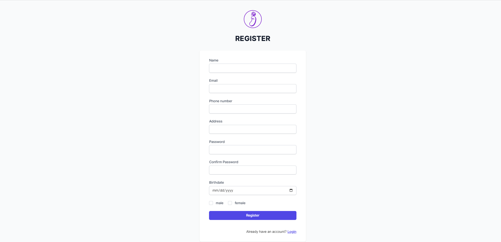
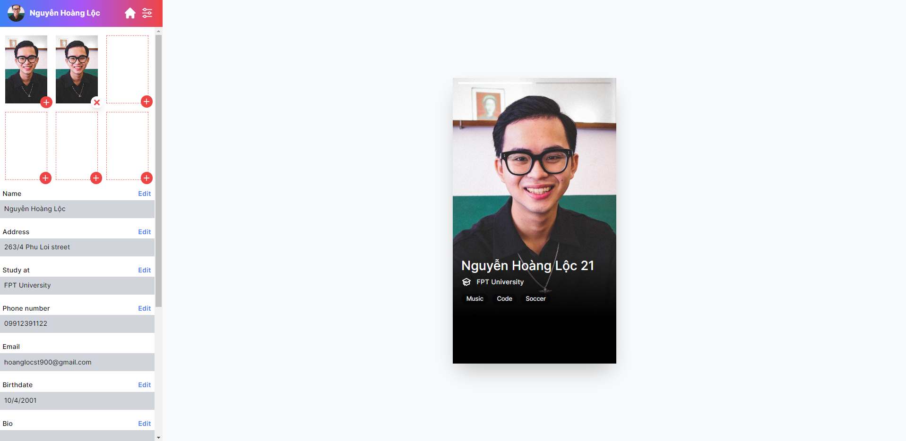

       

# Dating App - NestJs + ReactJs + Tailwind + Socket.IO + Redis

## Summary

An online dating app for teenager to finding new relationship by matching and chatting.

## Feature by role

- ### Action

  - Login, register and logout
  - Update user information
  - Like, dislike user profile
  - Chat (after matching)

## Technology

- Frontend
  - ReactJs
  - Tailwind - Styling
  - Socket.IO
- Backend
  - NestJs
  - Socket.IO
- Database
  - MYSQL
  - Redis
- Deployment
  - Docker - Container Management.
  - GitHub Action

## Team Member

- Đậu Lê Đức | Full-Stack
  - Gmail: dauleduc2@gmail.com
  - Linkedin: www.linkedin.com/in/ducdauu
  - Github: https://github.com/dauleduc2
- Nguyễn Hoàng Lộc | Backend
  - Gmail: hoanglocst900@gmail.com
  - Linkedin: https://www.linkedin.com/in/locnguyenhoang/
  - Github: https://github.com/niskyB

## Project Picture

### Database Diagram

#### Relation Diagram

### Login Page

### Register Page

### User Profile Page

### Option Page

### Matching Page

### Chatting Page

## Bug Report

Feel free to create an issue request anytime we will check it out and fix it as soon as possible. Thank You So Much.

### Tetcha © 2021
